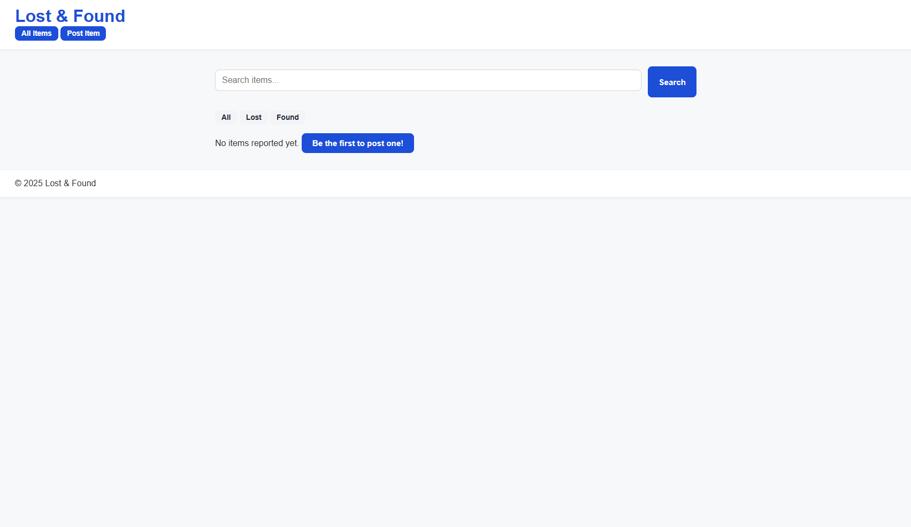

# Lost and Found Tracker

A clean and modern **web application** built with **Go (Golang)** to help users post, manage, and browse **lost and found items** with ease.  
It’s a lightweight, self-contained project using **HTML templates**, **CSS styling**, and a **SQLite database** for persistent storage.

---

## Features

- **Post Items** – Users can add lost or found items with details (title, description, contact, image, etc.)
- **Browse & Filter** – Quickly view all items or filter by Lost / Found.
- **Edit & Update** – Modify item details directly via the edit page.
- **Mark as Found** – Track when a lost item has been successfully found.
- **Timestamps** – Each item logs creation and “found” dates.
- **Modern UI** – Simple, responsive, and minimal design using CSS for a clean experience.

---


## Project Structure

```bash
├── main.go # Main application file (routes, handlers)
├── internal/
│ └── db.go # Database setup and functions
├── web/
│ └── static/
│   └── uploads/
│     └── # Images when uploaded in item
│   └── style.css # Modern styling for the entire app
│ └── templates/
│   └── layout.tmpl # Base layout used by all pages
│   └── index.tmpl # Home page showing all/lost/found items
│   └── new.tmpl # Form to post a new item
│   └── edit.tmpl # Page for editing existing items
│   └── show.tmpl # Detailed view of a single item
│   └── ... # Additional reusable templates
└── lostfound.db # SQLite database (auto-created if missing)
```
---

## Installation & Setup

1. **Clone the repository**
   ```bash
   git clone https://github.com/Cookies101-cookies/lost-and-found-tracker.git
   cd lost-and-found-tracker

2. **Run the app**
   ```bash
   go run .

3. **Open in your browser**
   ```bash
   http://localhost:8080

---

## Tech Stack
- Language: Go (Golang)
- Database: SQLite
- Frontend: HTML Templates + CSS
- Architecture MVC-inspired (handlers + templates + database)

---

## Screenshots

### Home Page


### Post New Item


### Item Details


---

## Future Enhancements
- User authentication
- Storage improvements
- Category filters (Electronics, Clothing, etc.)
